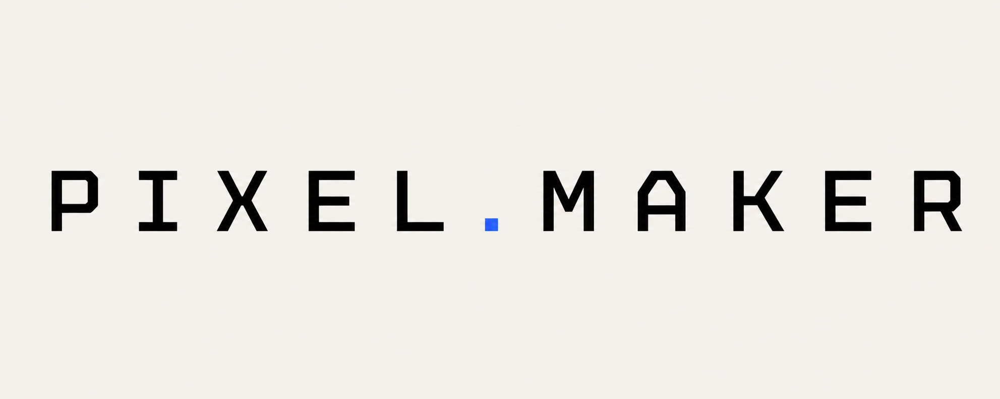
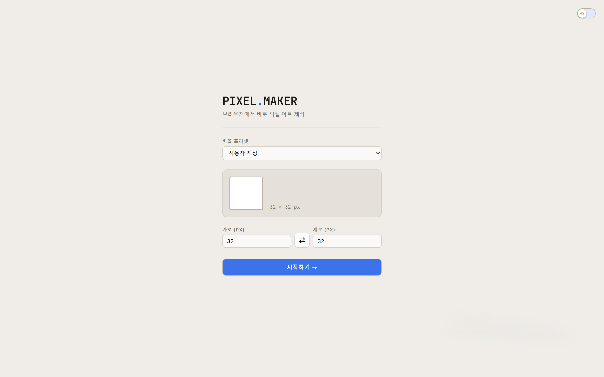
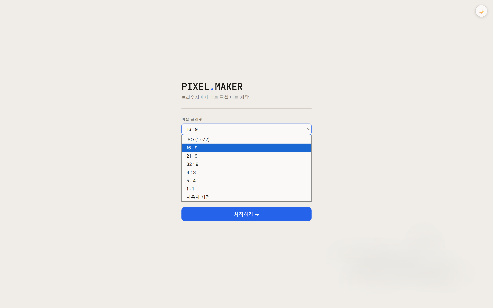
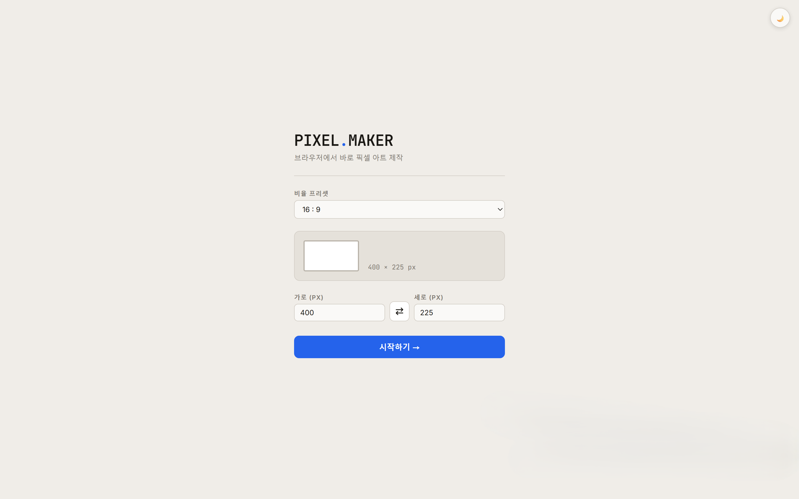
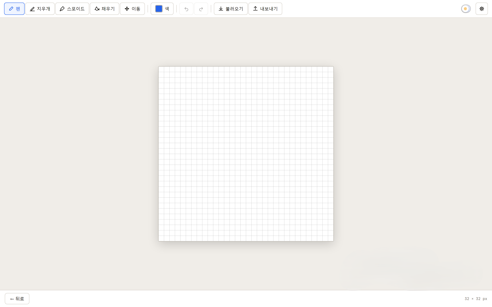
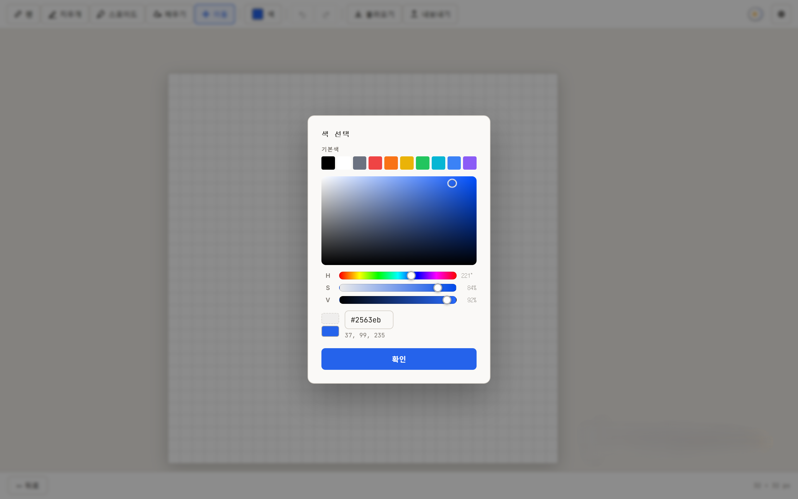

<div align="center">



# PIXEL MAKER

**브라우저에서 바로 픽셀 아트를 만드는 웹 에디터**
<br/>
<sub>A browser-based pixel art editor — draw, export, and continue where you left off</sub>

<br/>

[](https://react.dev)
[](https://vitejs.dev)
[](https://github.com/henry6134/final-project-Ryu-Sung-Hyun/actions/workflows/deploy.yml)

### ▶ [**라이브 데모 열기**](https://henry6134.github.io/final-project-Ryu-Sung-Hyun/)

<br/>

**접속 화면**


</div>

---

## ✨ 한눈에 보기

**PIXEL MAKER**는 설치 없이 브라우저에서 바로 픽셀 아트를 제작할 수 있는 웹 앱입니다.
원하는 용지 비율과 픽셀 수를 자유롭게 설정하고, 펜·지우개·스포이드·이동 도구로 직접 그린 뒤 PNG·JPG·JSON으로 저장할 수 있습니다.

저장한 JSON을 다시 불러와 이어서 작업하거나, 기존 이미지를 픽셀로 변환하거나 배경 종이로 깔아 참고할 수도 있습니다.

---

## 📱 스크린샷

<table>
  <tr>
    <td align="center">
            
      <br/><sub><b>초기 화면</b></sub>
    </td>
    <td align="center">      
      
      <br/><sub><br/>비율 프리셋 · 픽셀 수 입력 · 가로↔세로 전환</sub>
    </td>
    <td align="center">
      
      <br/><sub><b>에디터 화면</b><br/>툴바 · 캔버스 · 라이트/다크 모드</sub>
    </td>
  </tr>
  <tr>
    <td align="center">
      
      <br/><sub><b>색 선택 팝업</b><br/>기본색 · 히스토리 · SV 필드 · HSV 슬라이더</sub>
    </td>
    <td align="center">
            
      <br/><sub><b>내보내기</b><br/>PNG · JPG · JSON</sub>
    </td>
  </tr>
</table>

---

## 🎯 핵심 기능

| | 기능 | 설명 |
|:--:|---|---|
| ✏️ | **픽셀 단위 드로잉** | 펜·지우개·스포이드·이동 4가지 도구. 펜/지우개는 브러시 크기 조절 가능. |
| 🎨 | **통합 색 선택** | 기본색 10개 + 사용 히스토리 + SV 그라디언트 필드 + H·S·V 슬라이더 3줄을 팝업 하나로. |
| 📐 | **자유로운 용지 설정** | ISO·16:9·21:9·32:9·4:3·5:4·1:1 프리셋 및 사용자 지정. 가로↔세로 전환 버튼 포함. |
| 🖼 | **배경 이미지** | 불러온 이미지를 픽셀로 변환하거나, 반투명 배경 종이로 깔아 참고용으로 사용. |
| 💾 | **내보내기 / 불러오기** | PNG(투명 배경) · JPG(흰 배경) · JSON 저장. JSON으로 이어서 작업 가능. |
| ↩ | **Undo / Redo** | 모든 드로잉 작업에 실행 취소·다시 실행 지원. |
| 🔍 | **확대 / 이동** | 마우스 휠로 캔버스 확대·축소, 이동 도구로 pan. |
| 🌙 | **라이트 / 다크 모드** | 툴바 토글로 언제든 전환. 용지 배경은 라이트·다크 모두 흰색 유지. |

---

## 🚀 실행 방법

앱 링크: [https://henry6134.github.io/final-project-Ryu-Sung-Hyun/](https://henry6134.github.io/final-project-Ryu-Sung-Hyun/)

**로컬 실행**

```bash
npm install
npm run dev
```

**배포** — `main` 브랜치에 push하면 GitHub Actions가 자동으로 빌드 후 GitHub Pages에 배포합니다.

```bash
git add .
git commit -m "update"
git push origin main
```

---

## 🛠 기술 스택

- **Framework** — React 18, Vite 5
- **언어** — JavaScript (JSX)
- **스타일** — CSS Variables 기반 라이트/다크 테마 시스템
- **캔버스** — HTML5 Canvas API (image-rendering: pixelated)
- **CI/CD** — GitHub Actions → GitHub Pages 자동 배포

---

## 🤖 AI 사용

이 프로젝트는 AI를 활용해 초기 기능 정리, 파일 구조 설계, 코드 뼈대 작성, UI 수정안 보완에 도움을 받았습니다.
최종 코드는 요구사항에 맞게 직접 수정하고 검토했습니다.

AI LOG 링크: [AI 사용 기록 바로가기](./AI_Log.md)

---

## 📂 프로젝트 구조

```
pixel-maker/
├── src/
│   ├── components/        # UI 컴포넌트 (Toolbar, CanvasBoard, ColorPanel 등)
│   ├── hooks/             # usePixelEditor, useHistory
│   ├── utils/             # exportFile, importFile, ratio
│   ├── constants/         # presets.js
│   └── styles/            # globals.css, theme.css, editor.css, setup.css
├── .github/workflows/     # GitHub Pages 자동 배포
├── index.html
├── vite.config.js
└── package.json
```

---

## 개선한 점

1. 색 선택 UI를 단계적 팝업에서 SV 그라디언트 필드 + HSV 슬라이더 통합 팝업으로 교체해 한 번에 세밀한 색 조절이 가능해졌습니다.
2. 불러오기 기능을 이미지→픽셀 변환과 배경 종이 설정으로 분리하여, 참고 이미지를 보면서 트레이싱하듯 작업할 수 있게 되었습니다.

개선 기록: [개선 기록 바로가기](./ImprovementLog.md)
<div align="center">
<br/>
<sub>Made with React · Vite · HTML5 Canvas</sub>
</div>
